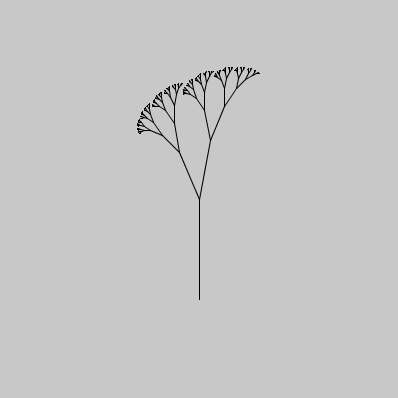

# Processing-Examples
####A collection of examples in Processing (Java)

Contains:

- recursive examples
- branching system

##recursiveExamples

Recursively splitting the screen in half (and repeating that) until the parts are so small that we cannot split any further.  
The original repo lived at https://github.com/ArtezGDA/recursiveExamples

## branching_system

Simple processing sketch that draws a simple L-system

The original repo lived at https://github.com/ArtezGDA/branching_system
