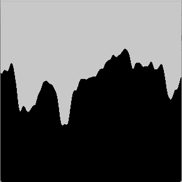

# Processing-Examples
####A collection of examples in Processing (Java)

Contains:

- recursive examples
- branching system
- fibonnaci_spiral
- perlin_noise examples

##recursiveExamples

Recursively splitting the screen in half (and repeating that) until the parts are so small that we cannot split any further.  
The original repo lived at https://github.com/ArtezGDA/recursiveExamples

**recursive_split**  

**taking top-left-bottom-right order into account**  

## branching_system

Simple processing sketch that draws a simple L-system

The original repo lived at https://github.com/ArtezGDA/branching_system

## fibonnaci_spiral

Simple processing sketch that draws a sunflower-like pattern

The original repo lived at https://github.com/ArtezGDA/fibonnaci_spiral

## perlin_noise examples

Examples of Perlin Noise  

